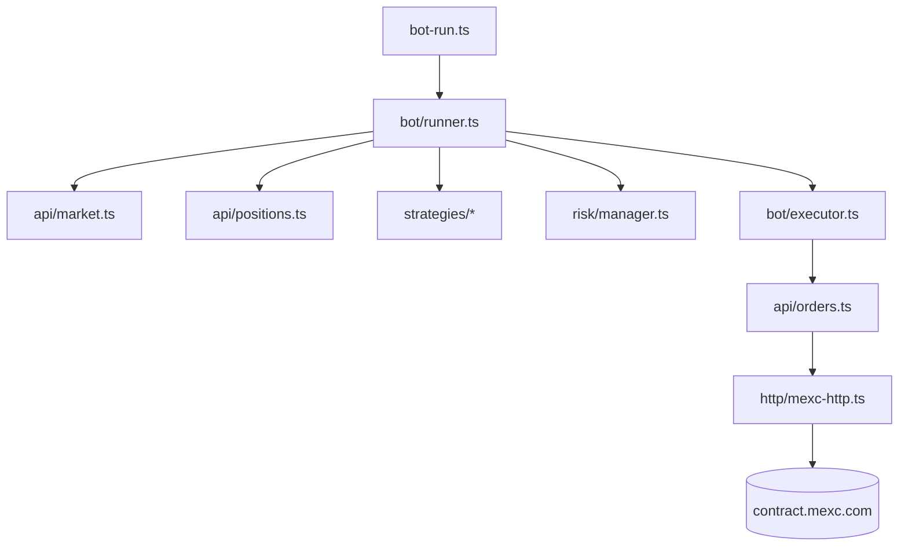

# Architecture

## Auth modes

1. **Open API** — `MEXC_API_KEY` + `MEXC_API_SECRET` with HMAC-SHA256 headers (`ApiKey`, `Request-Time`, `Signature`).
2. **Web session** — `MEXC_KEY` or `MEXC_API_KEY` as `Authorization`, optional `MEXC_COOKIE` and `MEXC_FINGERPRINT`.

## Tick lifecycle

Each poll interval loads ticker, 15m klines, open positions, and USDT equity, evaluates the active strategy, runs risk checks, then submits or simulates orders.
